# Arquitetura de Fundação para MCPs e AI Agents na AWS

## Contexto e Motivação

Com a crescente adoção de AI Agents e a necessidade de integração padronizada entre LLMs e fontes de dados externas, o Model Context Protocol (MCP) emerge como um padrão fundamental. Esta arquitetura visa estabelecer uma fundação escalável, segura e eficiente para suportar tanto cenários de prova de conceito quanto implementações de produção em larga escala.

## Premissas Arquiteturais

### Premissas Fundamentais

#### 1. Centralização de Acesso via AgentCore Gateway

**Premissa**: Todos os MCPs são acessados exclusivamente via AgentCore Gateway, independentemente do domínio ou contexto de negócio.

**Justificativa Técnica**:
- **Ponto Único de Controle**: Centraliza autenticação, autorização, rate limiting e auditoria
- **Abstração de Complexidade**: Agents não precisam conhecer detalhes de conectividade específicos de cada MCP
- **Observabilidade Unificada**: Métricas, logs e traces centralizados para todos os MCPs
- **Versionamento e Compatibilidade**: Gateway gerencia diferentes versões de MCPs de forma transparente
- **Resiliência**: Circuit breakers, retry policies e failover centralizados

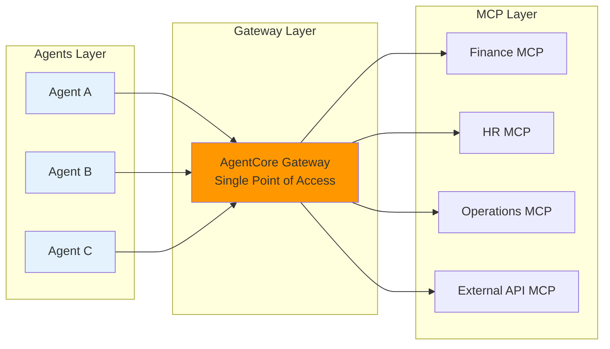

#### 2. Comunicação Agent-to-Agent (A2A) para Extensibilidade
**Premissa**: A comunicação Agent-to-Agent deve ser utilizada para estender capacidades dos agentes através de composição, evitando a criação de agentes monolíticos.

**Justificativa Técnica**:
- **Princípio da Responsabilidade Única**: Cada agent mantém foco em seu domínio específico
- **Composição sobre Herança**: Agents especializados podem ser combinados para resolver problemas complexos
- **Escalabilidade Horizontal**: Agents podem ser escalados independentemente baseado na demanda
- **Manutenibilidade**: Mudanças em um domínio não afetam outros agents
- **Reutilização**: Agents especializados podem ser reutilizados em diferentes contextos

**Padrões de Comunicação A2A**:
- **Orquestração**: Um agent coordenador chama outros agents sequencialmente
- **Coreografia**: Agents colaboram através de eventos assíncronos
- **Pipeline**: Agents processam dados em cadeia (output de um é input do próximo)

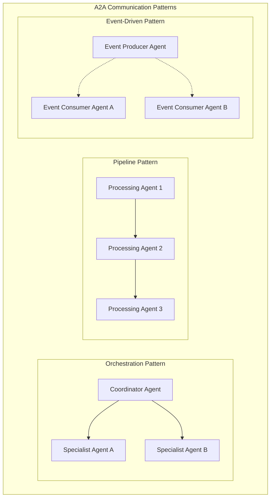

#### 3. Integração com Recursos VPC Privada
**Premissa**: MCPs devem suportar integração segura com recursos em VPC privada (RDS, ElastiCache, APIs internas) sem exposição desnecessária.

**Justificativa Técnica**:
- **Segurança por Design**: Recursos sensíveis permanecem em redes privadas
- **Compliance**: Atende requisitos de segurança e conformidade regulatória
- **Performance**: Comunicação interna de baixa latência
- **Controle de Acesso**: Security groups e NACLs para controle granular

**Implementação Técnica**:
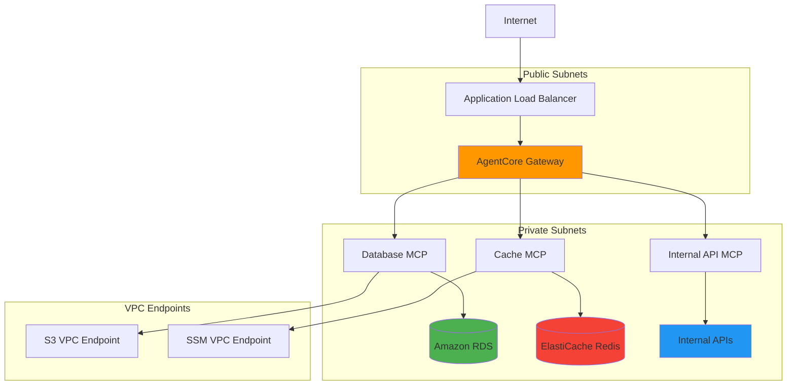

#### 4. Acesso Direto via MCP Clients com DCR
**Premissa**: Para casos que requerem conexão direta com MCPs (bypassing agents), utilizar MCP Clients autenticados via Keycloak com Dynamic Client Registration para facilitar configuração.

**Justificativa Técnica**:
- **Flexibilidade**: Suporta casos de uso que não se adequam ao padrão agent-based
- **Configuração Simplificada**: DCR elimina processo manual de registro de clientes
- **Segurança Mantida**: Autenticação e autorização robustas mesmo em acesso direto
- **Auditoria Completa**: Todos os acessos são rastreados e auditados

**Casos de Uso Válidos**:
- Ferramentas de desenvolvimento e debugging
- Integrações legacy que não podem ser refatoradas
- Aplicações batch que processam grandes volumes
- Ferramentas de monitoramento e observabilidade

#### 5. Isolamento de Tenancy
**Premissa**: Cada tenant (organização/projeto) deve ter isolamento lógico completo de dados e configurações.

**Implementação**:
- Namespaces Kubernetes dedicados por tenant
- Políticas de rede restritivas entre tenants
- Encryption keys separadas por tenant
- Métricas e logs segregados

#### 6. Versionamento e Compatibilidade
**Premissa**: MCPs devem suportar versionamento semântico e manter compatibilidade backward por pelo menos 2 versões major.

**Estratégia**:
- Versionamento de APIs via headers ou path
- Deprecation warnings com timeline claro
- Testes automatizados de compatibilidade
- Blue/green deployments para atualizações

#### 7. Observabilidade como Cidadão de Primeira Classe
**Premissa**: Todos os componentes devem implementar observabilidade completa (metrics, logs, traces) desde o primeiro deploy.

**Requisitos**:
- OpenTelemetry para traces distribuídos
- Structured logging em formato JSON
- Métricas de negócio e técnicas
- SLIs/SLOs definidos para cada componente


#### 8. Princípio de Least Privilege
**Premissa**: Todos os componentes operam com permissões mínimas necessárias, com revisão regular de privilégios.

**Controles**:
- IAM roles específicas por função
- Service accounts dedicadas no Kubernetes
- Rotação automática de credenciais
- Auditoria de permissões mensais

### Matriz de Decisão Arquitetural

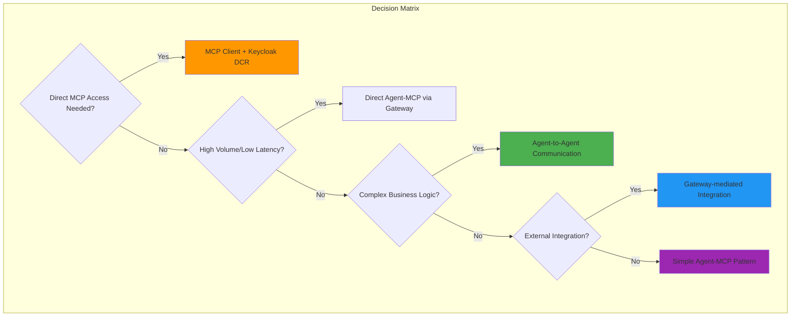


## Arquitetura de Alto Nível

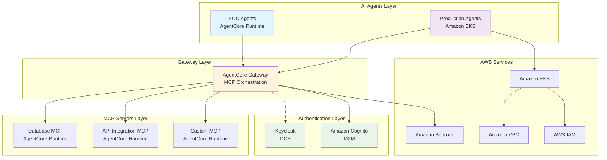

## Componentes Principais

### 1. AgentCore Gateway

O **Amazon Bedrock AgentCore Gateway** atua como o componente central da arquitetura, fornecendo:

- **Orquestração de MCPs**: Ponto único de controle para roteamento, autenticação e gerenciamento de ferramentas
- **Transformação de APIs**: Conversão automática de APIs REST existentes em servidores MCP compatíveis
- **Suporte Nativo ao MCP**: Implementação completa do Model Context Protocol conforme especificação oficial
- **Descoberta Inteligente**: Capacidade de descoberta automática de ferramentas disponíveis
- **Infraestrutura Serverless**: Gerenciamento automático de infraestrutura para servidores MCP

**Características Técnicas:**
- Suporte a especificações OpenAPI e modelos Smithy
- Integração nativa com AWS Lambda
- Autorização de entrada e saída integrada
- Isolamento de sessão com microVMs dedicadas

### 2. MCP Servers (AgentCore Runtime)

#### Fluxo de Comunicação MCP

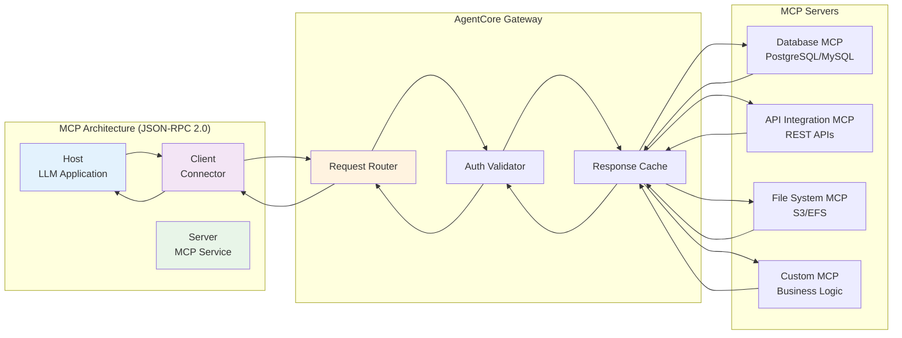

Todos os servidores MCP são executados no **AgentCore Runtime**, proporcionando:

- **Isolamento Seguro**: Cada sessão de usuário é executada em microVMs dedicadas
- **Escalabilidade Automática**: Dimensionamento baseado na demanda
- **Gerenciamento Simplificado**: Abstração da complexidade de infraestrutura
- **Protocolo Padronizado**: Implementação completa do MCP usando JSON-RPC 2.0

**Referências Técnicas:**
- Baseado na especificação MCP v2025-11-25 (modelcontextprotocol.io)
- Comunicação via JSON-RPC 2.0 conforme RFC 7591
- Arquitetura client-host-server padrão do MCP

### 3. AI Agents - Abordagem Dual

#### 3.1 Ambiente de POC (AgentCore Runtime)

Para prototipagem e desenvolvimento inicial:

- **Simplicidade**: Deploy rápido sem configuração de infraestrutura
- **Custo Otimizado**: Modelo serverless com cobrança por uso
- **Desenvolvimento Ágil**: Foco na lógica de negócio sem overhead operacional

#### 3.2 Ambiente de Produção (Amazon EKS)

Para cargas de trabalho críticas e em escala:

- **Alta Disponibilidade**: Distribuição multi-AZ automática
- **Escalabilidade Avançada**: Karpenter e Auto Mode para gerenciamento dinâmico
- **Controle Granular**: Configuração detalhada de recursos e políticas
- **Integração Nativa**: VPC CNI, IRSA, e integração com serviços AWS

**Características do EKS (2025):**
- EKS Auto Mode para gerenciamento automatizado
- EKS Capabilities para orquestração simplificada
- Suporte a EC2, Fargate e nós híbridos
- Integração com EBS, EFS e FSx para armazenamento

## Estratégia de Autenticação

### Fluxo de Autenticação Completo

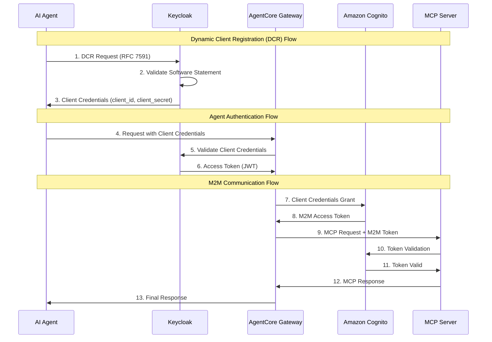

### 4.1 Keycloak para Dynamic Client Registration (DCR)

**Casos de Uso:**
- Registro dinâmico de clientes MCP
- Cenários que requerem flexibilidade de registro
- Integração com sistemas de identidade existentes

**Implementação Técnica:**
- Conformidade com RFC 7591 (OAuth 2.0 Dynamic Client Registration)
- Suporte a software statements para validação de clientes
- Registro anônimo e protegido conforme necessidade

**Exemplo de Fluxo DCR:**
```json
{
  "software_id": "MCP-CLIENT-001",
  "client_name": "AI Agent MCP Client",
  "client_uri": "https://agent.example.com/",
  "grant_types": ["client_credentials"],
  "token_endpoint_auth_method": "client_secret_basic"
}
```

### 4.2 Amazon Cognito para Machine-to-Machine (M2M)

**Casos de Uso:**
- Comunicação Gateway → MCP Servers
- Autenticação entre serviços internos
- Cenários de alta escala e performance

**Implementação Técnica:**
- OAuth 2.0 Client Credentials Grant
- Tokens JWT com scopes específicos
- Integração nativa com API Gateway para validação

**Vantagens da Abordagem Híbrida:**
- **Distribuição de Carga**: Keycloak para DCR complexo, Cognito para M2M em escala
- **Otimização de Custos**: Uso eficiente de recursos de cada serviço
- **Flexibilidade**: Adaptação a diferentes padrões de uso

## Implementação Detalhada

### 5.1 Configuração do AgentCore Gateway

```yaml
# Configuração exemplo do Gateway
gateway_config:
  mcp_servers:
    - name: "database-mcp"
      runtime: "agentcore"
      auth_method: "cognito_m2m"
      scopes: ["read:database", "write:database"]
    
    - name: "api-integration-mcp"
      runtime: "agentcore"
      source_api: "https://api.example.com/openapi.json"
      auth_method: "cognito_m2m"
      scopes: ["read:api"]

  authentication:
    cognito:
      user_pool_id: "us-east-1_XXXXXXXXX"
      client_id: "gateway-client-id"
    
    keycloak:
      realm: "mcp-realm"
      dcr_endpoint: "https://keycloak.example.com/auth/realms/mcp-realm/clients-registrations/openid-connect"
```

### 5.2 Configuração do EKS para Produção

#### Arquitetura de Rede EKS

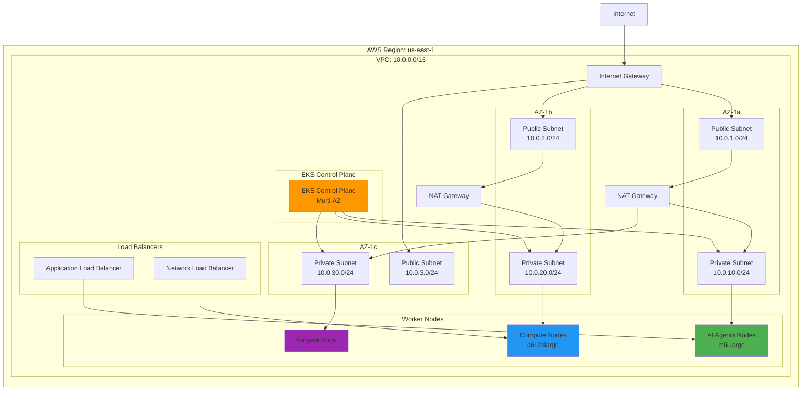

```yaml
# EKS Cluster Configuration
apiVersion: eksctl.io/v1alpha5
kind: ClusterConfig

metadata:
  name: ai-agents-production
  region: us-east-1
  version: "1.31"

# EKS Auto Mode habilitado
autoMode:
  enabled: true

# Configuração de nós para diferentes workloads
managedNodeGroups:
  - name: ai-agents-general
    instanceTypes: ["m6i.large", "m6i.xlarge"]
    minSize: 2
    maxSize: 10
    desiredCapacity: 3
    
  - name: ai-agents-compute
    instanceTypes: ["c6i.2xlarge", "c6i.4xlarge"]
    minSize: 0
    maxSize: 20
    desiredCapacity: 0
    taints:
      - key: workload-type
        value: compute-intensive
        effect: NoSchedule

# Integração com serviços AWS
iam:
  withOIDC: true
  serviceAccounts:
    - metadata:
        name: ai-agent-service
        namespace: production
      attachPolicyARNs:
        - arn:aws:iam::aws:policy/AmazonBedrockFullAccess
        - arn:aws:iam::aws:policy/AmazonCognitoPowerUser
```

### 5.3 Configuração de Segurança

```yaml
# Network Policies para isolamento
apiVersion: networking.k8s.io/v1
kind: NetworkPolicy
metadata:
  name: ai-agents-isolation
  namespace: production
spec:
  podSelector:
    matchLabels:
      app: ai-agent
  policyTypes:
  - Ingress
  - Egress
  ingress:
  - from:
    - namespaceSelector:
        matchLabels:
          name: gateway
    ports:
    - protocol: TCP
      port: 8080
  egress:
  - to:
    - namespaceSelector:
        matchLabels:
          name: mcp-servers
    ports:
    - protocol: TCP
      port: 443
```

## Monitoramento e Observabilidade

### Arquitetura de Observabilidade

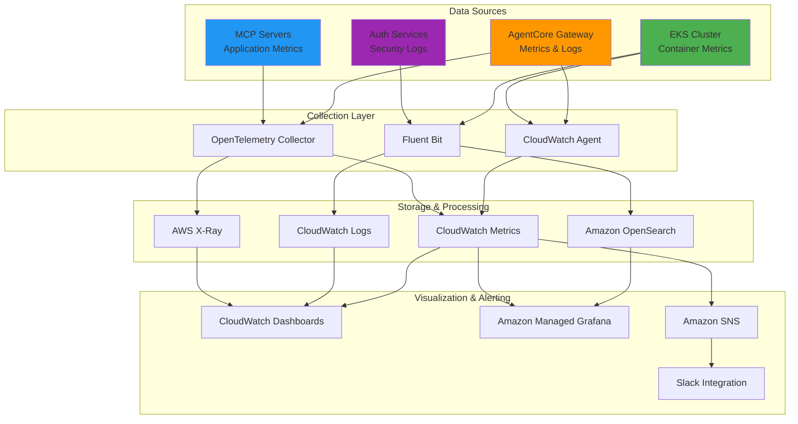

### 6.1 Métricas Essenciais

- **Gateway Performance**: Latência, throughput, taxa de erro
- **MCP Server Health**: Disponibilidade, tempo de resposta
- **Authentication Metrics**: Taxa de sucesso de autenticação, tokens emitidos
- **Resource Utilization**: CPU, memória, rede por componente

### 6.2 Logging Estruturado

```json
{
  "timestamp": "2025-01-02T10:30:00Z",
  "level": "INFO",
  "component": "agentcore-gateway",
  "event": "mcp_request",
  "details": {
    "client_id": "ai-agent-001",
    "mcp_server": "database-mcp",
    "method": "tools/list",
    "duration_ms": 45,
    "status": "success"
  }
}
```

## Considerações de Segurança

### 7.1 Princípios de Segurança

- **Zero Trust**: Verificação contínua de identidade e autorização
- **Least Privilege**: Permissões mínimas necessárias para cada componente
- **Defense in Depth**: Múltiplas camadas de segurança
- **Encryption Everywhere**: Dados em trânsito e em repouso sempre criptografados

### 7.2 Implementações Específicas

- **mTLS**: Comunicação segura entre todos os componentes
- **JWT Validation**: Validação rigorosa de tokens em todos os endpoints
- **Rate Limiting**: Proteção contra ataques de negação de serviço
- **Audit Logging**: Registro completo de todas as operações sensíveis

## Escalabilidade e Performance

### 8.1 Estratégias de Escalabilidade

- **Horizontal Scaling**: Auto-scaling baseado em métricas de CPU e memória
- **Vertical Scaling**: Ajuste dinâmico de recursos por pod
- **Geographic Distribution**: Deploy multi-região para redução de latência
- **Caching Inteligente**: Cache de respostas MCP frequentes

### 8.2 Otimizações de Performance

- **Connection Pooling**: Reutilização de conexões para MCPs
- **Async Processing**: Processamento assíncrono para operações longas
- **Load Balancing**: Distribuição inteligente de carga entre instâncias
- **Resource Optimization**: Configuração otimizada de recursos por workload

## Custos e Otimização

### Modelo de Custos por Ambiente

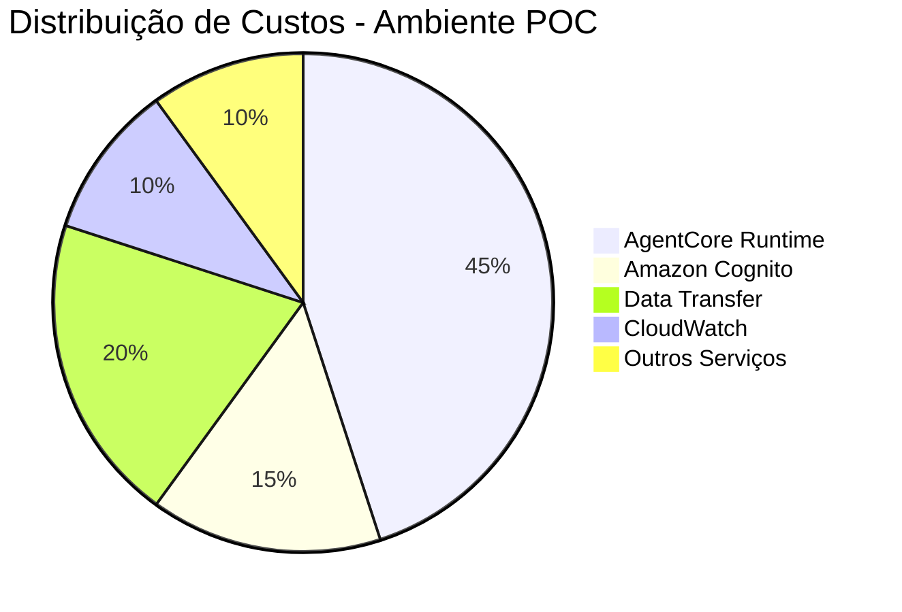

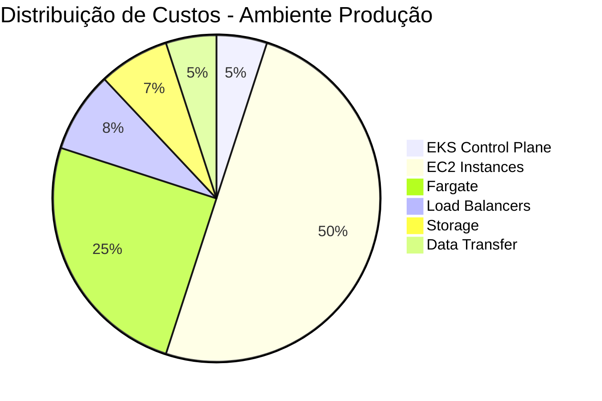

### Estratégia de Otimização de Custos

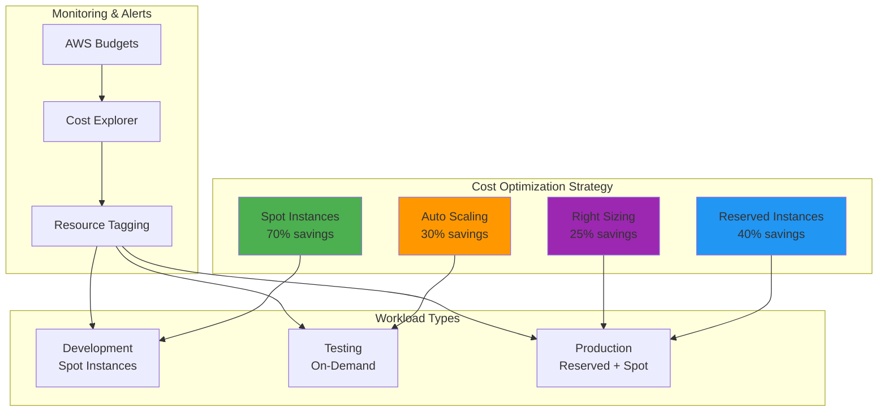

### 9.1 Modelo de Custos

**POC Environment:**
- AgentCore Runtime: $0.10/hora por instância ativa
- Cognito: $0.0055 por MAU (Monthly Active User)
- Data Transfer: $0.09/GB

**Production Environment:**
- EKS Control Plane: $0.10/hora
- EC2 Instances: Variável baseado no tipo de instância
- Fargate: $0.04048/vCPU/hora + $0.004445/GB/hora
- Load Balancer: $0.0225/hora

### 9.2 Estratégias de Otimização

- **Spot Instances**: Uso de instâncias spot para workloads tolerantes a interrupção
- **Reserved Instances**: Reserva de capacidade para cargas previsíveis
- **Auto Scaling**: Dimensionamento automático baseado em demanda
- **Resource Tagging**: Rastreamento detalhado de custos por projeto/ambiente

## Roadmap de Implementação

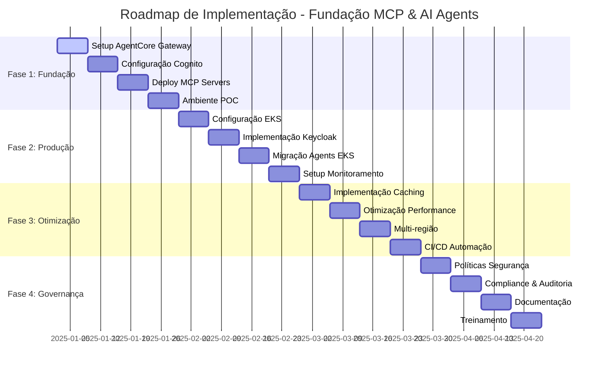

### Detalhamento das Fases

### Fase 1: Fundação (Semanas 1-4)
- [ ] Setup do AgentCore Gateway
- [ ] Configuração básica do Cognito
- [ ] Deploy de MCP servers de exemplo
- [ ] Ambiente de POC funcional

### Fase 2: Produção (Semanas 5-8)
- [ ] Configuração do cluster EKS
- [ ] Implementação do Keycloak
- [ ] Migração de agents para EKS
- [ ] Configuração de monitoramento

### Fase 3: Otimização (Semanas 9-12)
- [ ] Implementação de caching
- [ ] Otimização de performance
- [ ] Configuração de multi-região
- [ ] Automação completa de CI/CD

### Fase 4: Governança (Semanas 13-16)
- [ ] Políticas de segurança avançadas
- [ ] Compliance e auditoria
- [ ] Documentação completa
- [ ] Treinamento de equipes

## Referências Técnicas

### RFCs e Especificações
- **RFC 7591**: OAuth 2.0 Dynamic Client Registration Protocol
- **RFC 6749**: The OAuth 2.0 Authorization Framework
- **RFC 7636**: Proof Key for Code Exchange by OAuth Public Clients
- **RFC 8707**: Resource Indicators for OAuth 2.0
- **MCP Specification**: Model Context Protocol v2025-11-25

### Documentação AWS
- [Amazon EKS Best Practices Guide](https://aws.github.io/aws-eks-best-practices/)
- [Amazon Cognito Developer Guide](https://docs.aws.amazon.com/cognito/)
- [Amazon Bedrock AgentCore Documentation](https://aws.amazon.com/bedrock/agentcore/)
- [AWS Security Reference Architecture](https://docs.aws.amazon.com/prescriptive-guidance/latest/security-reference-architecture/)

### Recursos Adicionais
- [Model Context Protocol Official Site](https://modelcontextprotocol.io/)
- [Keycloak Documentation](https://www.keycloak.org/documentation)
- [OAuth 2.0 Security Best Practices](https://datatracker.ietf.org/doc/html/draft-ietf-oauth-security-topics)

## Conclusão

Esta arquitetura fornece uma base sólida e escalável para implementação de MCPs e AI Agents na AWS, combinando a simplicidade do AgentCore Runtime para desenvolvimento e POCs com a robustez do Amazon EKS para ambientes de produção. A estratégia de autenticação híbrida (Keycloak + Cognito) oferece flexibilidade e otimização de custos, enquanto o AgentCore Gateway centraliza o gerenciamento e orquestração de MCPs.

A implementação faseada permite evolução gradual da solução, minimizando riscos e permitindo aprendizado contínuo. O foco em segurança, observabilidade e otimização de custos garante que a solução seja adequada para ambientes empresariais críticos.

---

**Versão**: 1.0  
**Data**: Janeiro 2025  
**Autor**: Arquitetura de Soluções AWS  
**Status**: Documento Vivo - Sujeito a atualizações baseadas em feedback e evolução das tecnologias